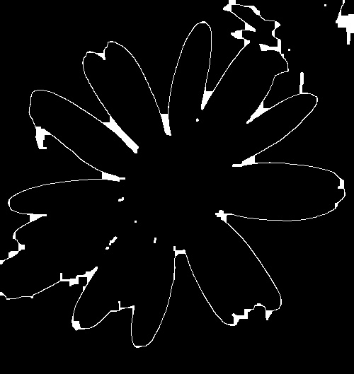

# Flower Image Segmentation Pipeline

This repository implements and evaluates multiple image segmentation techniques for flower images with varying lighting, shapes, and noise levels. The pipeline includes: image preposessing, segmentaion function, post processing and evaluation.

## Features

- Automatic segmentation using:
  - Otsu Thresholding
  - Split and Merge
  - Canny Edge Detection
  - Marker-based Watershed
- Pre-processing pipeline with bilateral filtering and HSV adjustments
- Evaluation using Intersection over Ground Truth (IoGT)
- Performance comparison via visual results and tables

## Dataset

The dataset consists of labeled flower images. Images were categorized into `easy`, `medium`, and `hard` based on segmentation difficulty.

## Segmentation Methods

### Otsu Thresholding
A global thresholding method using histogram analysis. Achieved the highest IoGT average.

**Example**  


### Split and Merge
Region-based segmentation that recursively divides and merges image regions.

**Example**  


### Canny Edge Detection
Edge-based method combined with contour filling and morphological operations.

**Example**  




### Watershed
Marker-based algorithm used to separate overlapping flower petals.

**Example**  


## Post-Processing

Applied morphological opening to remove small noise and artifacts post-segmentation.

---

## Results

| Method           | Mean IoGT |
|------------------|-----------|
| Otsu Thresholding| 0.83      |
| Split and Merge  | 0.80      |
| Watershed        | 0.56      |
| Canny Detection  | 0.20      |


## 🛠 How to Run

1. Clone the repository:
   ```bash
   git clone https://github.com/yourusername/flower-segmentation.git
   cd flower-segmentation
2. To run each indidual pipeline corresponding to a segmentation method :
   ```bash
   python Coursework/Threshold.py
   python Coursework/splitMerge.py
   python Coursework/Canny.py
   python Coursework/watershed.py


